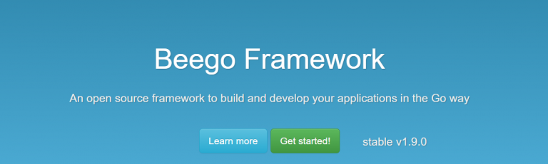

# beego初步

#### 简介
[beego](https://beego.me/)是国内团队开源的golang开发框架,是一个关注度和使用量都比价高的项目。

Beego是一个成熟的MVC框架，它有着自己的日志库、ORM和web框架。你不需要再查找和安装第三方的库。Beego还有一个内置的工具bee，这个工具可以实时的监控代码的更改。

Beego可以大量的节省你的开发时间，尤其是项目初期可以帮你创建日志框架和程序架构。

## 快速启动 Quick Start

[beego文档快速入门](https://beego.me/quickstart)中给出一个很简单的例子。

#### 安装

beego 包含一些示例应用程序以帮您学习并使用 beego 应用框架。

你需要安装或者升级 Beego 和 Bee 的开发工具:

	$ go get -u github.com/astaxie/beego
	$ go get -u github.com/beego/bee

为了能够直接使用bee命令，需要将$GOPATH/bin添加到$PATH变量中。

#### 创建应用
创建一个名为hello的应用，可以选择web应用，或者api应用:
	$ bee new hello     //创建一个web应用
	$ bee api hello     //创建一个api应用

执行结束后，会在当前目录下创建名为hello的目录：
		.
		|____hello
		| |____conf
		| | |____app.conf
		| |____controllers
		| | |____default.go
		| |____main.go
		| |____models
		| |____routers
		| | |____router.go
		| |____static
		| | |____css
		| | |____img
		| | |____js
		| | | |____reload.min.js
		| |____tests
		| | |____default_test.go
		| |____views
		| | |____index.tpl