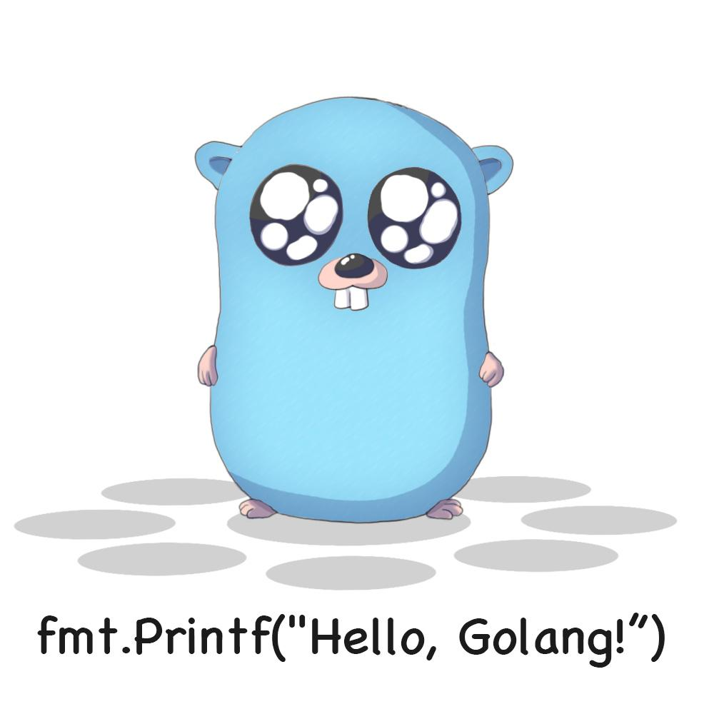

## 第一个Go程序



&nbsp;&nbsp;如果读者学习过C语言，应该使用过C语言编写过第一个"Hello World"程序。使用Go编写这个程序几乎没有什么区别。<br />
&nbsp;&nbsp;不过我想用1876年3月10日，贝尔用电话第一次发出的声音来做这个程序。<br />
 <br />
程序名pro02_3.go
```go
package main //package名称，主运行的package名规定为main
//包引入区 
import ( //（不能另起一行
	"fmt"
)

//主函数
func main() {// {不能另起一行，{不能另起一行,{不能另起一行,重要的事情说三遍,这个是go的强制规定，
	fmt.Println("Mr. Watson, Come Here, I Want You! \r\n 沃特森先生,过来，我想见你！") //March 10, 1876: ‘Mr. Watson, Come Here … ‘
	//go的字符串都是unicode编码的。
}
```

在命令行里面输入 go run pro02_3.go
程序结果就会显示出来。<br />


## 链接
- [目录](https://github.com/sunnygocms/gobook/blob/master/menu.md)
- [上一节](https://github.com/sunnygocms/gobook/blob/master/go_lang_base/02.2.md)
- [下一节](https://github.com/sunnygocms/gobook/blob/master/go_lang_base/02.4.md)