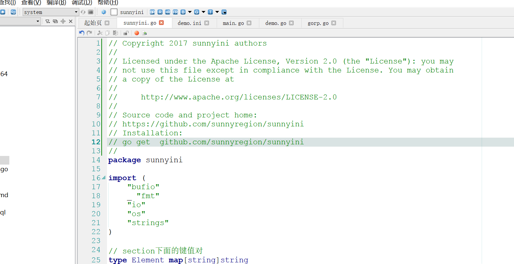

## Go语言的注释
	行注释：//xxxxxx
	块注释：/* xxxxxx */
Go支持C语言风格的/* */块注释，
也支持C＋＋风格的//行注释。 当然，行注释更通用，块注释主要用于针对包的详细说明或者屏蔽大块的代码。

每个包都应有一个包注解，即 package 前的块注解。对多个文件的包，包注解只需出现在一个文件中，随便哪个。包注解应该介绍此包，并作为一个整体提供此包的对应信息。它首先出现在 godoc 页面，来安排好后续的详细文档。



文注解最好是完整的句子。首句应该以声明的名字开始的一句话的总结。
```go
// Compile parses a regular expression and returns, if successful,
// a Regexp that can be used to match against text.
func Compile(str string) (*Regexp, error) {
```

## 链接
- [目录](https://github.com/sunnygocms/gobook/blob/master/menu.md)
- [上一节](./02.5.md)
- [下一节](./03.1.md)