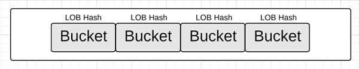
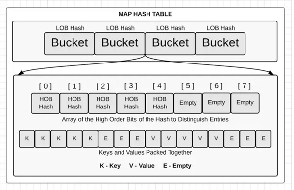
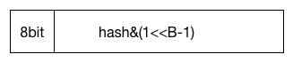
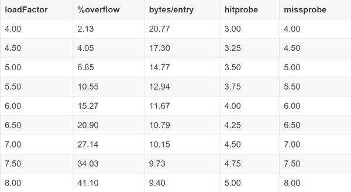
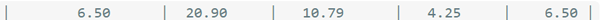

## Map字典
&nbsp;&nbsp;在Go中，Map又称字典类型，它就是一个hash表。计算机科学里面最有用的数据结构之一就是hash表。不同的hash表实现提供了很多独特的特性。但是基本上都包括元素查询，添加和删除。Go提供了一个内置的类型map，这个类型实现了hash表的基本功能。

&nbsp;&nbsp;所以在Go语言里面如果你需要使用hash表，那么就用map吧。因为Go是强类型语言，所以你必须为map的键和对应的值指定具体的类型。这些键或值的类型可以是字符串，整型，指向结构体的指针等。

#### map的创建
&nbsp;&nbsp;map的创建有四种方式：
```go
make ( map [KeyType] ValueType, initialCapacity )
make ( map [KeyType] ValueType )
map [KeyType ] ValueType {}
map [KeyType ] ValueType { key1 : value1, key2: value2, ... , keyN : valueN}
```
&nbsp;&nbsp;其中第一种和第二种的区别在于，有没有指定初始容量，不过使用的时候则无需在意这些，因为map的本质决定了，一旦容量不够，它会自动扩容。
[pro03_6_1.go](https://github.com/sunnygocms/gobook/blob/master/src/go_lang_base/03/pro03_6_1.go)
```go
package main

import "fmt"

func main() {
	map1 := make(map[string]int, 7)
	map2 := make(map[string]int)
	map3 := map[string]int{}
	map4 := map[string]int{"Mon": 0, "Tue": 1, "Wed": 2, "Thu": 3, "Fri": 4, "Sat": 5, "Sun": 6}
	fmt.Println(map1, map2, map3, map4)
}
```

输出结果：

map[] map[] map[] map[Mon:0 Tue:1 Wed:2 Thu:3 Fri:4 Sat:5 Sun:6]

map的每个单位就是一对key:value，key 可以是任意可以用 == 或者 != 操作符比较的类型，比如 string、int、float。所以数组、切片和结构体不能作为 key，但是指针和接口类型可以。Go语言中大部分类型都能做key，某些类型是不能的，这些不能作为Key的类型的共同特点是：不能使用==来比较，包括: slice, map, function.

value 可以是任意类型的；通过使用空接口类型，我们可以存储任意值，但是使用这种类型作为值时需要先做一次类型断言。

为了说明value 可以是任意类型的，我举一个例子：
[pro03_6_2.go](https://github.com/sunnygocms/gobook/blob/master/src/go_lang_base/03/pro03_6_2.go)
```go
func main() {
	sunnyMap := map[int]func() string{
		0: func() string { return "aaaa" },  //使用匿名函数做map的value
		1: func() string { return "bbbb" },
		2: func() string { return "cccc" },
	}
	fmt.Println(sunnyMap)
}
```

输出结果：

map[0:0x401200 3:0x401220 9:0x401240] 

value都被映射到了匿名函数地址。
#### map的填充和遍历
map的遍历使用for range
[pro03_6_3.go](https://github.com/sunnygocms/gobook/blob/master/src/go_lang_base/03/pro03_6_3.go)
```go
func main() {
	sunnyMap := make(map[int]string)
	sunnyMap[0] = "Mon"
	sunnyMap[1] = "Tue"
	sunnyMap[2] = "Wed"
	sunnyMap[3] = "Thu"
	sunnyMap[4] = "Fri"
	sunnyMap[5] = "Sat"
	sunnyMap[6] = "Sun"

	for key, value := range sunnyMap {
		fmt.Printf("%d->%s\r\n", key, value)
	}
}

```

**遍历的输出结果**，我们正常的会以为，输出结果是这样的

    0->Mon
    1->Tue
    2->Wed
    3->Thu
    4->Fri
    5->Sat
    6->Sun

可是更可能，我们见到的输出结果是这样的

    2->Wed
    3->Thu
    4->Fri
    5->Sat
    6->Sun
    0->Mon
    1->Tue  

&nbsp;&nbsp;而且每次运行的输出结果顺序都是随机的。Go语言的设计者们注意到人们过于依赖这种通常情况下key的存储顺序和key的添加顺序一致的特性，所以他们把key的遍历顺序随机化了。GO的map 类似c++里的unordered_map，是无序的，开发者不希望map有内置的有序特性。因此，如果你希望key的输出顺序和添加顺序一致的话，你需要自己做一下排序。
[pro03_6_4.go](https://github.com/sunnygocms/gobook/blob/master/src/go_lang_base/03/pro03_6_4.go)

```go
func main() {
	sunnyMap := make(map[int]string)
	sunnyMap[0] = "Mon"
	sunnyMap[1] = "Tue"
	sunnyMap[2] = "Wed"
	sunnyMap[3] = "Thu"
	sunnyMap[4] = "Fri"
	sunnyMap[5] = "Sat"
	sunnyMap[6] = "Sun"

	var keys []int
	for key, _ := range sunnyMap {
		keys = append(keys, key)
	}
	sort.Ints(keys)
	for _, i := range keys {
		fmt.Printf("%d->%s\r\n", i, sunnyMap[i])
	}
}
```

#### 长度、查询、查找、修改和删除
map的长度计算用len，但是**注意一点：map不支持cap计算容量。**

**查找**

    value, isExist := sunnyMap["Mon"]

map指定key取对应的value时，可以指定两个返回值，第一个是对应的value，第二个是一个bool值，表示是否有值。true表示有值，false表示没值。

[pro03_6_5.go](https://github.com/sunnygocms/gobook/blob/master/src/go_lang_base/03/pro03_6_5.go)

```go
func main() {
	sunnyMap := map[string]string{"Mon": "一", "Tue": "二", "Wed": "三", "Thu": "四", "Fri": "五", "Sat": "六", "Sun": "日"}
	val1, isExist1 := sunnyMap["Sat"]
	val2, isExist2 := sunnyMap["sat"]

	fmt.Println("Sat is exist?", isExist1, "value:", val1)
	fmt.Println("sat is exist?", isExist2, "value:", val2)
}
```
输出结果：
    Sat is exist? true value: 六
    sat is exist? false value:
**有一点要注意，如果value是数值型的，isExist返回值为false的时候，value的值是0。**还有，从key是Sta有值，而sat无值可以看出Go是区分大小写的。

**修改**
sunnyMap["key"]=value

**删除** 则是使用go的内置函数delete

[pro03_6_6.go](https://github.com/sunnygocms/gobook/blob/master/src/go_lang_base/03/pro03_6_6.go)
```go
func main() {
	sunnyMap := map[string]string{"Mon": "一", "Tue": "二", "Wed": "三", "Thu": "四", "Fri": "五", "Sat": "六", "Sun": "日"}
	delete(sunnyMap, "Mon")
	fmt.Println(sunnyMap)
}

```

显示结果：map[Sun:日 Tue:二 Wed:三 Thu:四 Fri:五 Sat:六]

#### map的value使用slice
使用过PHP的程序员都很喜欢PHP里面array，这个使用起来非常的随意方便，GO中的map就相当于PHP里面的array，尤其是配合上切片slice一起使用：[pro03_6_7.go](https://github.com/sunnygocms/gobook/blob/master/src/go_lang_base/03/pro03_6_7.go)

```go
func main() {
	sunnyMap := map[string][]string{"a": {"一", "a", "b"}, "b": {"二", "hello"}, "c": {"三"}}
	sunnyMap["c"] = append(sunnyMap["c"], "hhh")
	fmt.Println(sunnyMap)
}

```

显示结果：map[b:[二 hello] c:[三 hhh] a:[一 a b]]

## 内部结构 hashmap结构
golang的map是hash结构的，同传统的hashmap一样，由一个个bucket组成:

```go
// A header for a Go map.
type hmap struct {
 // Note: the format of the Hmap is encoded in ../../cmd/internal/gc/reflect.go and
 // ../reflect/type.go.  Don't change this structure without also changing that code!
 count int // # live cells == size of map.  Must be first (used by len() builtin)
 flags uint8
 B     uint8  // log_2 of # of buckets (can hold up to loadFactor * 2^B items)
 hash0 uint32 // hash seed

 buckets    unsafe.Pointer // array of 2^B Buckets. may be nil if count==0.
 oldbuckets unsafe.Pointer // previous bucket array of half the size, non-nil only when growing
 nevacuate  uintptr        // progress counter for evacuation (buckets less than this have been evacuated)

 // If both key and value do not contain pointers and are inline, then we mark bucket
 // type as containing no pointers. This avoids scanning such maps.
 // However, bmap.overflow is a pointer. In order to keep overflow buckets
 // alive, we store pointers to all overflow buckets in hmap.overflow.
 // Overflow is used only if key and value do not contain pointers.
 // overflow[0] contains overflow buckets for hmap.buckets.
 // overflow[1] contains overflow buckets for hmap.oldbuckets.
 // The first indirection allows us to reduce static size of hmap.
 // The second indirection allows to store a pointer to the slice in hiter.
 overflow *[2]*[]*bmap
}
```

## bucket内部

```go
// A bucket for a Go map.
type bmap struct {
 tophash [bucketCnt]uint8 // Followed by bucketCnt keys and then bucketCnt values.
 // NOTE: packing all the keys together and then all the values together makes the
 // code a bit more complicated than alternating key/value/key/value/... but it allows
 // us to eliminate padding which would be needed for, e.g., map[int64]int8.
 // Followed by an overflow pointer.
}
```
#### 根据一个key得到value
```go
func mapaccess1(t *maptype, h *hmap, key unsafe.Pointer) unsafe.Pointer
```
maptype为map的类型信息，是编译器在编译期静态生成的，里面包含了map的一些元信息，比如 key和value的类型信息等等

- *hmap为map的header，即map的引用
- key是一个通用的指针，代表了key的引用
- 返回值为一个指针，指向对应的value引用
## hash计算找到bucket
那我们怎么访问到对应的bucket呢，我们需要得到对应key的hash值


```go
alg := t.key.alghash := alg.
hash(key, uintptr(h.hash0))
m := uintptr(1)<<h.B - 1
b := (*bmap)(add(h.buckets, (hash&m)*uintptr(t.bucketsize)))
```
## 根据 tophash 和 key 定位到具体的 bucket
tophash 可以快速试错，如果 tophash 不相等直接跳过
tophash 相等的话，根据 key 的比较来判断是否相等，如果相等则找到
如果当前 bucket 都试玩还没有找到，则调到下一个 bucket

## 扩容



#### 各个参数的意思：

- %overflow 溢出率，平均一个 bucket 有多少个 kv 的时候会溢出
- bytes/entry 平均存一个 kv 需要额外存储多少字节的数据
- hitprobe 找到一个存在的 key 平均需要找几下
- missprobe 找到一个不存在的 key 平均需要找几下

目前采用的是这一行:




## go使用指针作为map的key注意点

由于map的key仅限于基本类型，所以当想使用"结构体"当key时，只能使用其指针作为key。又由于map经常使用range进行遍历或者存取数据，这就出现问题啦？
例如，

```go
func main() {
	type A {
		b int
		c string
	}
	d := make(map[*A]int)
	i ：= 0
	for _, v := range s {
		i++
		d[&v]=i
	}
	println(len(d))
}
```
结果，

1

你知道为什么吗？这是因为在使用for, range时，变量v的内存地址是不变。所以要赋值内存地址的时候，赋值&s[i]，而不是&v。
## 链接
- [目录](https://github.com/sunnygocms/gobook/blob/master/menu.md)
- [上一节](https://github.com/sunnygocms/gobook/blob/master/go_lang_base/03.5.md)
- [下一节](https://github.com/sunnygocms/gobook/blob/master/go_lang_base/03.7.md)
