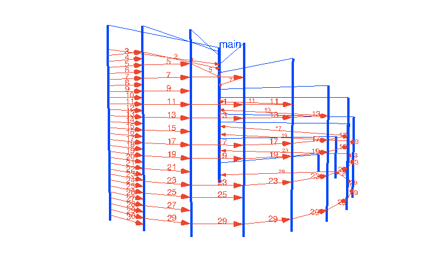
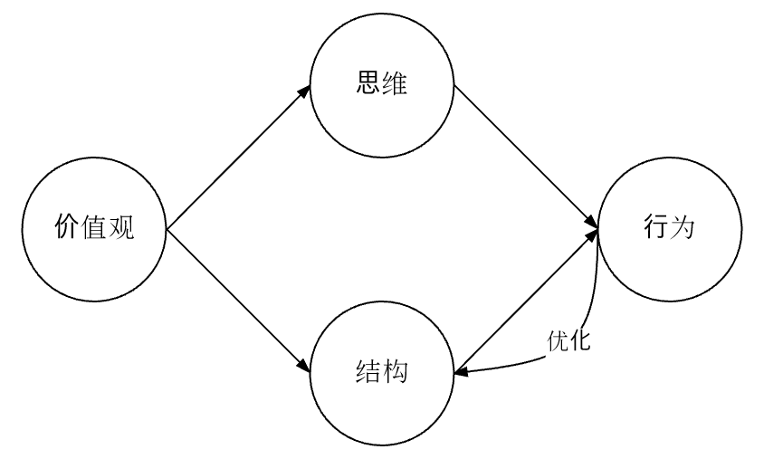

## Channel通道类型
&nbsp;&nbsp;管道提供了一种两个并发执行的函数进行同步执行或是通信的机制。管道里面只能传输某一种指定类型的值，初始化的管道的值是nil。

#### Go Channel的基本操作语法如下：

    c := make(chan bool) //创建一个无缓冲的bool型Channel

    c <- x        //向一个Channel发送一个值
    <- c          //从一个Channel中接收一个值
    x = <- c      //从Channel c接收一个值并将其存储到x中
    x, ok = <- c  //从Channel接收一个值，如果channel关闭了或没有数据，那么ok将被置为false


#### 通过实例解释Channel在Go语言中的使用。[文章引用](https://studygolang.com/articles/9777) 原文如下：<br />

本篇文章是作者在2017年第三届GopherChina大会上所作talk：”Go coding in go way“的改编和展开版，全文如下。

## 一、序
今天我要分享的题目是“Go coding in go way”，中文含义就是用“Go语言编程思维去写Go代码”。看到这个题目大家不禁要问：究竟什么是Go语言编程思维呢？关于什么是Go语言变成思维其实并没有官方说法。这里要和大家交流的内容都是基于Go诞生七年多以来我个人对Go的设计者、Go team以及Go主流社区的观点和代码行为的整理、分析和总结。希望通过我的这次“抛砖引玉”，让在座的Gopher们对“Go语言编程思维”有一个初步的认知，并在日常开发工作中遵循Go语言的编程思维，写出idiomatic的Go代码。

## 二、编程语言与编程思维
#### 1、大师的观点
在人类自然语言学界有一个很著名的假说：”萨丕尔-沃夫假说“，这个假说的内容是这样的：

    语言影响或决定人类的思维方式("Language inuences/determines thought" - Sapir-Whorf hypothesis )

说到这个假说，我们不能不提及在2017年初国内上映了一部口碑不错的美国科幻大片《降临》，这部片子改编自雨果奖获得者华裔科幻小说家Ted姜的《你一生的故事》，片中主线剧情的理论基础就是就是“萨丕尔-沃夫假说”。更夸张的是片中直接将该假说应用到外星人语言上，将其扩展到宇宙范畴^_^。片中的女主作为人类代表与外星人沟通，并学会了外星语言，从此思维大变，拥有了预知未来的“超能力”。由此我们可以看出“选择对一门语言是多么的重要”。

奇妙的是，在编程语言界，有位大师级人物也有着与”萨丕尔-沃夫假说”异曲同工的观点和认知。他就是首届图灵奖得主、著名计算机科学家Alan J. Perlis(艾伦·佩利)。他从另外一个角度提出了：

    “不能影响到你的编程思维方式的编程语言不值得去学习和使用”
    A language that doesn't affect the way you think about programming is not worth knowing.

#### 2、现实中的“投影”
从上述大师们的理论和观点，我们似乎看到了语言与思维之间存在着某种联系。那么两者间的这种联系在真实编程世界中的投影又是什么样子的呢？我们来看一个简单的编程问题：
    
    【问题: 素数筛】
    问题描述：素数是一个自然数，它具有两个截然不同的自然数除数：1和它本身。 
    要找到小于或等于给定整数n的素数。针对这个问题，我们可以采用埃拉托斯特尼素数筛算法。
    算法描述：先用最小的素数2去筛，把2的倍数剔除掉；下一个未筛除的数就是
    素数(这里是3)。再用这个素数3去筛，筛除掉3的倍数... 这样不断重复下去，直到
    筛完为止。

算法动图


下面是该素数筛算法的不同编程语言的实现版本。

C语言版本：
【sieve.c】
```C


void sieve() {
        int c, i,j,numbers[LIMIT], primes[PRIMES];

        for (i=0;i<LIMIT;i++){
                numbers[i]=i+2; /*fill the array with natural numbers*/
        }

        for (i=0;i<LIMIT;i++){
                if (numbers[i]!=-1){
                        for (j=2*numbers[i]-2;j<LIMIT;j+=numbers[i])
                                numbers[j]=-1; /*sieve the non-primes*/
                }
        }

        c = j = 0;
        for (i=0;i<LIMIT&&j<PRIMES;i++) {
                if (numbers[i]!=-1) {
                        primes[j++] = numbers[i]; /*transfer the primes to their own array*/
                        c++;
                }
        }

        for (i=0;i<c;i++) printf("%d\n",primes[i]);
}
```

Haskell版本：
【sieve.hs】

```haskell

sieve [] = []
sieve (x:xs) = x : sieve (filter (\a -> not $ a `mod` x == 0) xs)

n = 100
main = print $ sieve [2..n]
```

Go语言版本：
【[prime.go](https://github.com/sunnygocms/gobook/blob/master/src/go_lang_base/03/prime.go)】

```go

func generate(ch chan<- int) {
    for i := 2; ; i++ {
        ch <- i // Send 'i' to channel 'ch'.
    }
}

func filter(src <-chan int, dst chan<- int, prime int) {
    for i := range src { // Loop over values received from 'src'.
        if i%prime != 0 {
            dst <- i // Send 'i' to channel 'dst'.
        }
    }
}

func sieve() {
    ch := make(chan int) // Create a new channel.
    go generate(ch)      // Start generate() as a subprocess.
    for {
        prime := <-ch
        fmt.Print(prime, "\n")
        ch1 := make(chan int)
        go filter(ch, ch1, prime)
        ch = ch1
    }
}

```

- C版本的素数筛程序是一个常规实现。它定义了两个数组：numbers和primes，“筛”的过程在numbers这个数组中进行(纯内存修改)，非素数的数组元素被设置为-1，便于后续提取；
- Haskell版本采用了函数递归的思路，通过 “filter操作集合”，用谓词(过滤条件）\a -> not $ a mod x == 0；筛除素数的倍数，将未筛除的数的集合作为参数传递归递给下去；
- Go版本的素数筛实现采用的是goroutine的并发组合。程序从2开始，依次为每个素数建立一个goroutine，用于作为筛除该素数的倍数。ch指向当前最新输出素数所位于的筛子goroutine的源channel，这段代码来自于Rob Pike的一次关于concurrency的分享slide。

#### 3、思考
通过上述这个现实中的问题我们可以看到：面对同一个问题，来自不同编程语言的程序员给出了思维方式截然不同的解决方法：C的命令式思维、Haskell的函数式思维和Go的并发思维。这一定程度上印证了前面的假说：编程语言影响编程思维。

Go语言诞生较晚（2007年设计、2009年发布Go1），绝大多数Gopher(包括我在内)第一语言都不是Go，都是“半路出家”从其他语言转过来的，诸如：C、C++、Java、Python等，甚至是Javascript、Haskell、Lisp等。由于Go语言上手容易，在转Go的初期大家很快就掌握了Go的语法。但写着写着，就是发现自己写的代码总是感觉很别扭，并且总是尝试在Go语言中寻找自己上一门语言中熟悉的语法元素；自己的代码风格似乎和Go stdlib、主流Go开源项目的代码在思考角度和使用方式上存在较大差异。而每每看到Go core team member(比如：rob pike)的一些代码却总有一种醍醐灌顶的赶脚。这就是我们经常说的go coding in c way、in java way、in python way等。出现这种情况的主要原因就是大脑中的原有语言的思维方式在“作祟”。

我们学习和使用一门编程语言，目标就是要用这门语言思维方式去Coding。学习Go，就要用Go的编程思维去写Go代码，而不是用其他语言的思维方式。

#### 4、编程语言思维的形成
人类语言如何影响人类思维这个课题自然要留给人类语言学家去破解。但编程语言如何影响编程思维，每个程序员都有着自己的理解。作为一个有着十几年编程经验的程序员，我认为可以用下面这幅示意图来解释一门编程语言思维的形成机制：


决定编程语言思维的根本在于这门编程语言的价值观！什么是价值观？个人认为：一门编程语言的价值观就是这门语言的最初设计者对程序世界的认知。不同编程语言的价值观不尽相同，导致不同编程语言采用不同的语法结构，不同语言的使用者拥有着不同的思维方式，表现出针对特定问题的不同的行为（具现为：代码设计上的差异和代码风格上的不同），就像上面素数筛那样。比如：
    
    C的价值观摘录：

    - 相信程序员：提供指针和指针运算，让C程序员天马行空的发挥
    - 自己动手，丰衣足食：提供一个很小的标准库，其余的让程序员自造
    - 保持语言的短小和简单
    - 性能优先

    C++价值观摘录：

    - 支持多范式，不强迫程序员使用某个特定的范式
    - 不求完美，但求实用（并且立即可用）


此外，从上述模型图，我们可以看出思维和结构影响语言应用行为，这是语言应用的核心；同时存在一个反馈机制：即语言应用行为会反过来持续影响/优化语言结构。我们常用冰山表示一个事物的表象与内涵。如果说某种语言的惯用法idiomatic tips或者best practice这些具体行为是露出水面上的冰山头部，那么价值观和思维方式就是深藏在水面以下的冰山的基座。


## 一道有关channel的Go面试题——go 如何优雅的实现这个面试题

有四个线程1、2、3、4。线程1的功能就是输出1，线程2的功能就是输出2，以此类推.........现在有四个文件ABCD。初始都为空。现要让四个文件呈如下格式：


A：1 2 3 4 1 2....


B：2 3 4 1 2 3....


C：3 4 1 2 3 4....


D：4 1 2 3 4 1....

[源程序pro03_9_1.go](https://github.com/sunnygocms/gobook/blob/master/src/go_lang_base/03/pro03_9_1.go)

```go
	chs := make([]chan int, 4)
	for i := 0; i < len(chs); i++ {
		chs[i] = make(chan int)
		go func(i int) {
			for {
				chs[i] <- i + 1
			}
		}(i)
	}
	f := make([]bytes.Buffer, len(chs))

	for i := 0; i < 10; i++ {
		for j := 0; j < len(f); j++ {
			fmt.Fprintf(&f[j], "%d ", <-chs[(i+j)%len(chs)])
		}
	}
```

## 链接
- [目录](https://github.com/sunnygocms/gobook/blob/master/menu.md)
- [上一节](https://github.com/sunnygocms/gobook/blob/master/go_lang_base/03.8.md)
- [下一节](https://github.com/sunnygocms/gobook/blob/master/go_lang_base/03.10.md)