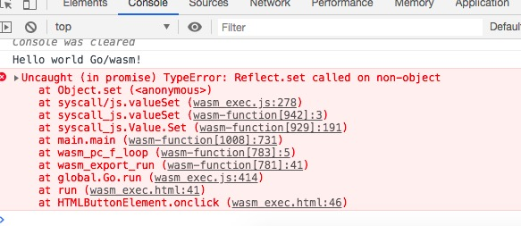
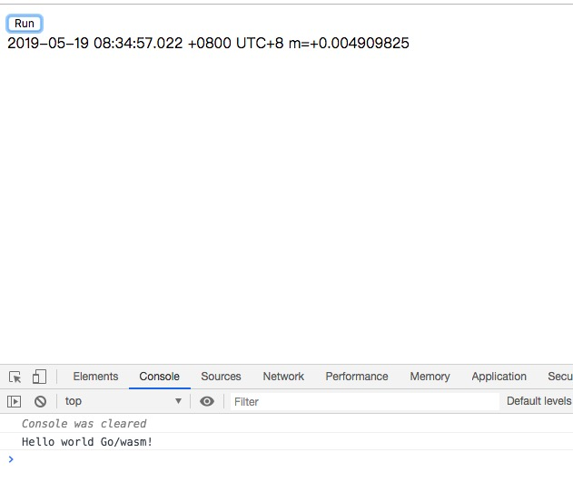

# Golang WebAssembly 入门
## WebAssembly 简称WASM


#### Golang 在1.11版本中引入了 WebAssembly 支持,意味着以后可以用 go编写可以在浏览器中运行的程序,当然这个肯定也是要受浏览器沙盒环境约束的.


## 1. 简单例子

### 1.1 code
```go
package main
func main() {
    println("Hello, WebAssembly!")
}
```
### 1.2 编译

必须是 go1.11以上版本才行

    GOARCH=wasm GOOS=js go build -o sunny.wasm wasm.go

### 1.3 运行

单独的 wasm 文件是无法直接运行的,必须载入浏览器中.

    mkdir html
    cp sunny.wasm test
    cd html
    cp $GOROOT/misc/wasm/wasm_exec.{html,js} .

#### 1.3.1 一个测试 http 服务器
    chrome 是不支持本地文件中运行 wasm 的,所以必须有一个 http 服务器
```go
    //http.go
    package main

    import (
        "flag"
        "log"
        "net/http"
        "strings"
    )

    var (
        listen = flag.String("listen", ":8080", "listen address")
        dir    = flag.String("dir", ".", "directory to serve")
    )

    func main() {
        flag.Parse()
        log.Printf("listening on %q...", *listen)
        log.Fatal(http.ListenAndServe(*listen, http.HandlerFunc(func(resp http.ResponseWriter, req *http.Request) {
            if strings.HasSuffix(req.URL.Path, ".wasm") {
                resp.Header().Set("content-type", "application/wasm")
            }

            http.FileServer(http.Dir(*dir)).ServeHTTP(resp, req)
        })))
    }
```
#### 1.3.2 http.go

    go run http.go

### 1.4 效果

在浏览器中打开http://localhost:8080/wasm_exec.html,点击 run 按钮,可以在控制台看到 Hello, WebAssembly!字符串


## 2. 升级玩法

使用"syscall/js" 这个包。

### 2.1 新做一个执行程序  wasm2.go

```go
package main

import (
	"syscall/js"
	"time"
)

func main() {
	js.Global().Get("console").Call("log", "Hello world Go/wasm!")
	js.Global().Get("document").Call("getElementById", "app").Set("innerText", time.Now().String())
}
```

### 2.2 编译

    GOARCH=wasm GOOS=js go build -o sunny.wasm wasm2.go
    cp sunny.wasm html

### 2.3 浏览器运行

有错误


仔细看程序，看到程序里面有这么一行
```go
js.Global().Get("document").Call("getElementById", "app").Set("innerText", time.Now().String())
}
```

直接在wasm_exec.html里面加上一行

```html
	<div id="app"></div>
```

### 2.4 浏览器再次运行




## 3. 再次升级玩法

希望时间持续刷新。我们希望时钟每5秒钟舒心一次，以前怎么做哪？需要前端每5秒使用Ajax去后台读取一次，现在不用了，使用WASM来做。

### 3.1 新做一个执行程序  wasm2.go

```go
package main

import (
	"syscall/js"
	"time"
)

func main() {
	for {
		go func() {
			js.Global().Get("console").Call("log", "Hello world Go/wasm!")
			js.Global().Get("document").Call("getElementById", "app").Set("innerText", time.Now().String())
		}()
		time.Sleep(5 * time.Second)
	}
	select {}
}
```

*** 里面最厉害的一句 ***

 ```go
// 保持 main 函数持续运行
select {}
```

### 3.2 编译

    GOARCH=wasm GOOS=js go build -o sunny.wasm wasm2.go
    cp sunny.wasm html

### 3.3 浏览器运行

每5秒刷新一次，完美。
